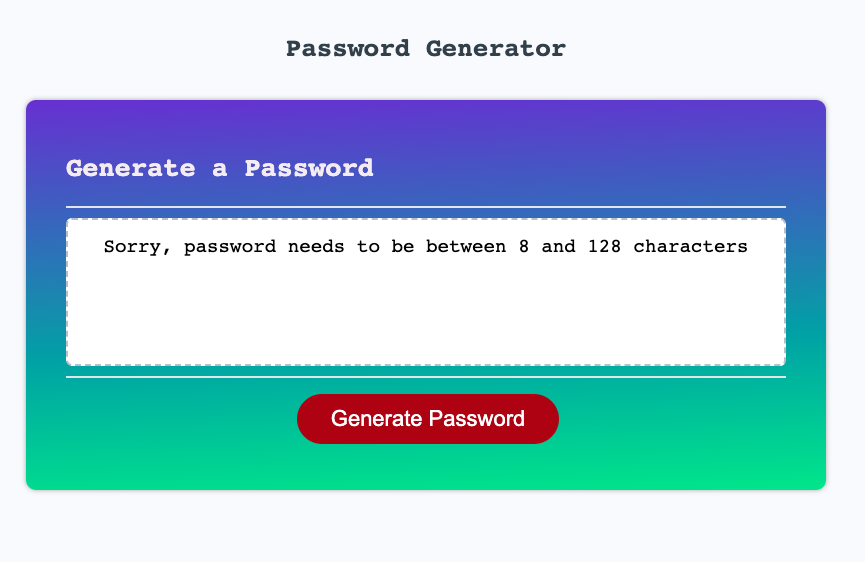

# password-gen-js

[Deployed Link Here](https://iqbalahmadi.github.io/password-gen-js/)

  

## Description 
This repo provides how to generate password from minimum 8 characters to 128 characters. 

## Badges 

## Built With

- HTML
- CSS
- JavaScript

## Usage

- When you click the button to generate a password, then you are presented with a series of prompts for password criteria. 
- When prompted for password criteria, then you select which criteria to include in the password
- When prompted for the length of the password, then you choose a length of at least 8 characters and no more than 128 characters
- When asked for character types to include in the password, then you confirm whether or not to include lowercase, uppercase, numeric, and/or special characters
- When you answer each prompt, then your input should be validated and at least one character type should be selected
- When all prompts are answered, then a password is generated that matches the selected criteria
- When the password is generated, then the password is written to the page

## Screenshot of the Page

The following image shows the website's current state

  

